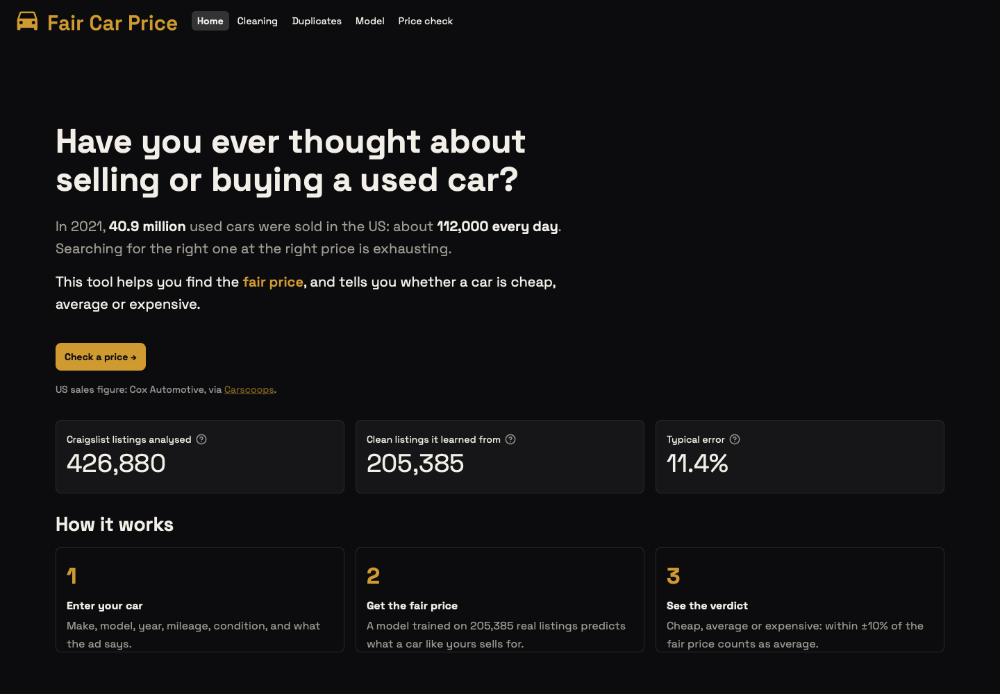
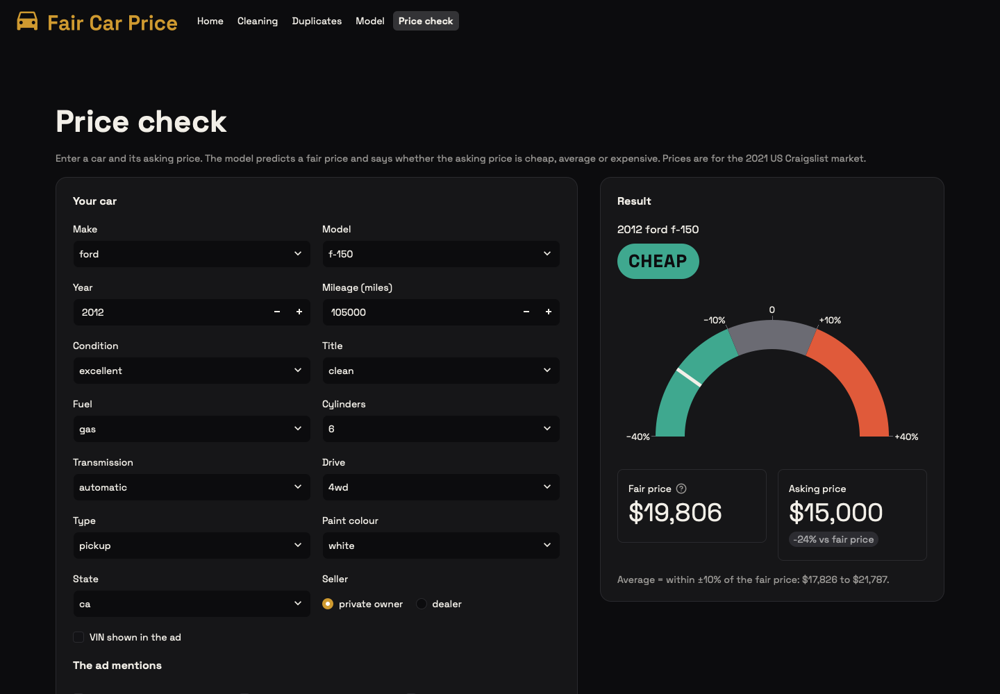
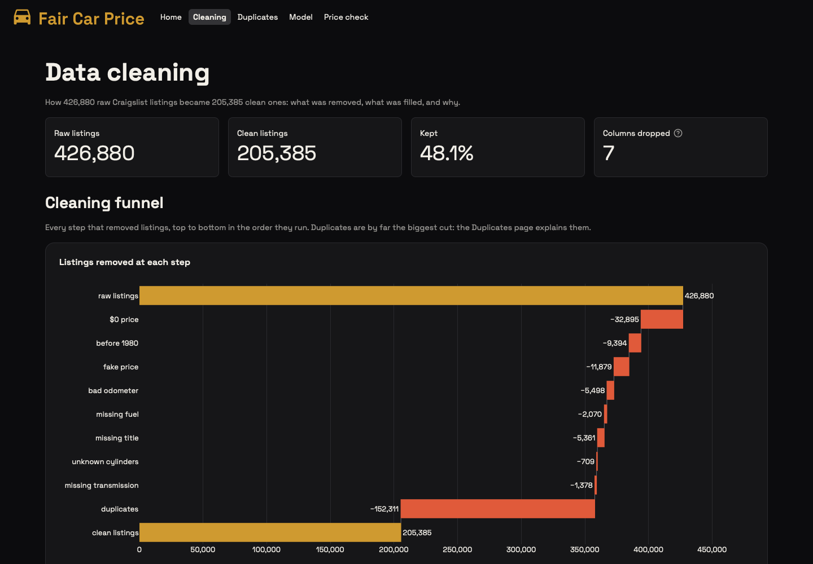
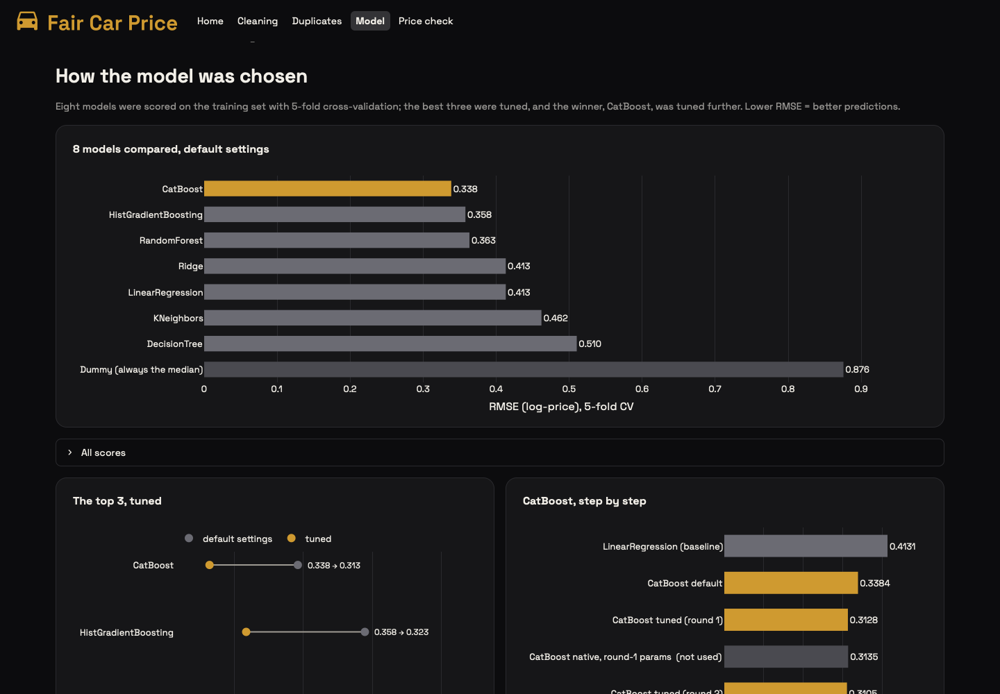
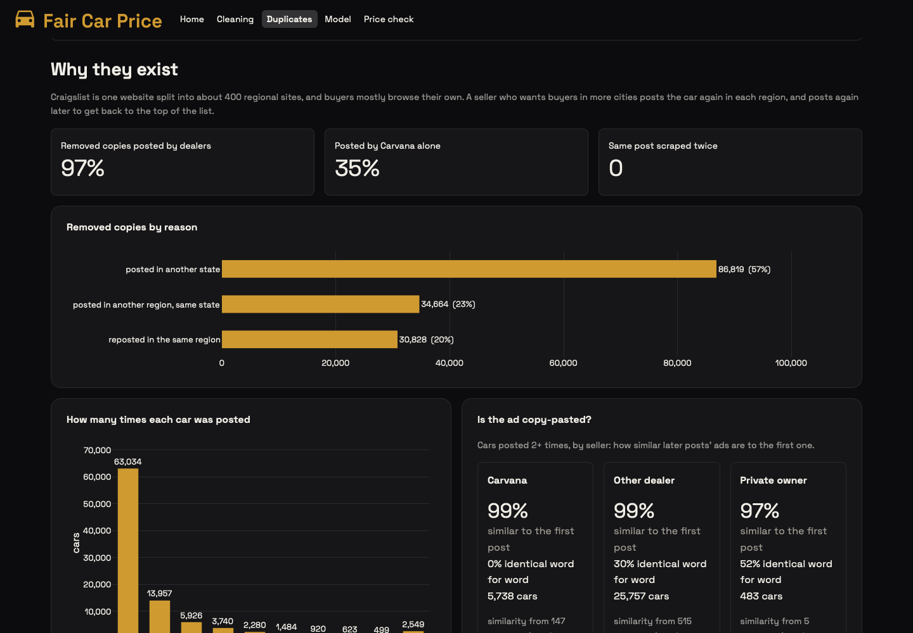

# Fair Car Price

Is that used car cheap, fair or overpriced? This project trains a model on 205,000 US Craigslist listings to predict what a car should cost, and puts it in a small Streamlit app where you enter a car and its asking price and get a verdict.



## What's in the app

The dashboard has five pages:

- **Home**: what the tool is for, in one screen.
- **Cleaning**: how 426,880 raw listings became 205,385 usable ones, step by step.
- **Duplicates**: why 42% of the listings that got through the other cleaning steps were the same car posted again, and how I checked that.
- **Model**: which models I tried, how the winner was tuned, and how it does on cars it never saw.
- **Price check**: the actual tool. Pick a make and model, fill in the rest, enter the asking price.



The verdict is simple on purpose: within ±10% of the predicted price is *average*, below that is *cheap*, above is *expensive*. The model's typical error is about 11%, so a tighter band would claim more precision than it has.

## The data

The [Used Cars Dataset](https://www.kaggle.com/datasets/austinreese/craigslist-carstrucks-data) on Kaggle (Austin Reese): every used-car listing on US Craigslist between April 4 and May 5, 2021. It's one 1.45 GB file, `vehicles.csv`, which isn't in the repo because of its size.

Most of the work went into cleaning it:

- Listings with no price, placeholder prices ($1, $1234567), prices over $200k and new cars listed at their monthly payment instead of their price are dropped. So are cars from before 1980, which follow collector pricing.
- The `model` column is free text: `f150 xlt`, `F-150 SuperCrew` and `ford f 150` are all the same truck. I sent the 9,763 spellings that appear 3+ times to Claude in batches and got back 935 clean model names (`01_data_cleaning_model_names.ipynb`).
- Missing values are filled from similar cars where that makes sense (a missing drive type gets the model's usual drive type), and dropped where guessing would be worse.
- Duplicates: dealers, Carvana especially, post the same car in dozens of cities. One 2017 Ford Expedition was posted 261 times in 38 states in one day. Removing exact copies took out 152,311 rows. I checked the removals against the VINs and the ad text, which the dedupe never looked at: 79% share a VIN with the listing that was kept, and only 60 turned out to be different cars.



## The model

The target is log(1 + price). I scored eight models with 5-fold cross-validation on the training set, tuned the best three, and kept CatBoost with one-hot encoded categories.



On the 20% test set, which I only scored once at the end:

| | CatBoost | Linear regression (baseline) |
|---|---|---|
| Median error | 11.4% | 18.3% |
| Average error | $2,308 | $3,717 |
| R² (log price) | 0.885 | 0.780 |

The average error is the average size of the miss, up or down. It's bigger for expensive cars and smaller for cheap ones, which is why the percentage is the more useful number. After the test, the model was retrained on all the data for the app.

Age and mileage matter most, followed by drive type, how long the ad text is, cylinders, condition and the model itself. Some of the strongest extra features came from the listing rather than the car: whether it's a dealer, whether the VIN is shown, and keywords in the description like "one owner", "lifted" or "needs work".



## Known limits

- Prices are 2021 Craigslist prices. The used-car market has moved a lot since then.
- Some reposts slip through the dedupe when the seller changes the price, so a few cars sit in both the training and the test set. On the validation set, reposts scored better than new cars (RMSE 0.275 vs 0.304), which means the test score is slightly optimistic. Keeping one listing per VIN would fix it; I haven't done that yet.
- The price check can't read an ad, so the description length is set to the median and the location to the middle of the chosen state.

## Running it

You need [uv](https://docs.astral.sh/uv/) and Python 3.13.

```bash
uv sync
uv run streamlit run dashboard/app.py
```

The Home, Cleaning, Duplicates and Model pages work straight away from the small CSVs in `data/dashboard/`. The Price check page needs the trained model (`models/final_model.joblib`, about 270 MB, not in the repo). To build it, and everything else, from scratch:

1. Download `vehicles.csv` from Kaggle into `data/`.
2. `01_data_cleaning_model_names.ipynb` maps the model names with the Claude API (needs `ANTHROPIC_API_KEY`). The mapping it produced is in `data/model_map.csv`.
3. Run `02_data_cleaning` and `04_modeling` (at least the feature cell), then `05_final_model`, which trains CatBoost twice and takes a while.
4. Run the `11`–`14` dashboard notebooks. They only prepare the CSVs the pages read.

`03_EDA` and `99_dups` are analysis only.

## Project layout

```
01–05_*.ipynb        cleaning, EDA, modeling and the final model
11–14_*.ipynb        numbers for the dashboard pages -> data/dashboard/
99_dups.ipynb        the duplicate investigation
dashboard/           the Streamlit app (one file per page, common.py for shared styling)
src/carpricepredictor/shared.py   file paths and column lists the notebooks share
```

All the data work happens in the notebooks. The app only reads their output.

## Disclaimer

This is a learning project, not financial advice. The prices are estimates from 2021 listings. I'm not responsible for any car you buy or sell based on it.
